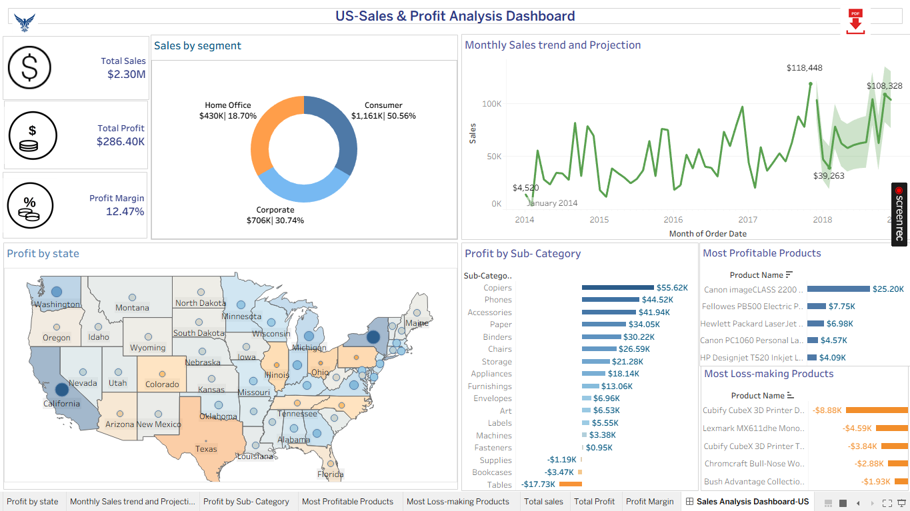

# US-Sales & Profit Analysis Tableau

Interactive Tableau dashboard analyzing US sales, profit, profit margin, customer segments, states, sub-categories, and product profitability.

# US Sales & Profit Analysis Dashboard – Tableau

## 📊 Project Overview

This project presents an interactive Tableau dashboard developed
to analyze US sales and profitability performance.

The dashboard helps identify sales trends, profitable states,
customer segments, sub-categories, and profitable and
loss-making products.

## 🎯 Business Objectives

- Analyze overall sales and profit performance
- Understand sales contribution by customer segment
- Analyze monthly sales trends
- Identify profitable and loss-making states
- Analyze profit by sub-category
- Identify most profitable products
- Identify loss-making products

## 📌 Key KPIs

- Total Sales
- Total Profit
- Profit Margin

## 📈 Dashboard Analysis

### Sales by Segment
Analyzes sales contribution from Consumer, Corporate,
and Home Office segments.

### Monthly Sales Trend
Shows monthly sales performance and trend over time.

### Profit by State
Provides geographical analysis of profitability across US states.

### Profit by Sub-Category
Highlights profitable and less profitable product sub-categories.

### Most Profitable Products
Identifies products generating the highest profit.

### Most Loss-Making Products
Identifies products contributing to the highest losses.

## 🛠️ Tools Used

- Tableau
- Data Visualization
- Sales Analysis
- Profit Analysis
- Dashboard Development
- Business Analytics

## 📷 Dashboard Preview

## 💡 Key Learnings

This project helped me understand how to transform sales data
into interactive visualizations and derive meaningful business
insights from sales and profitability data.
